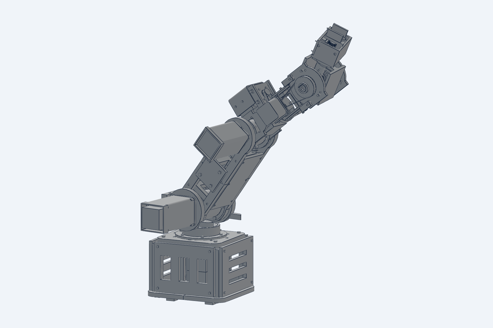
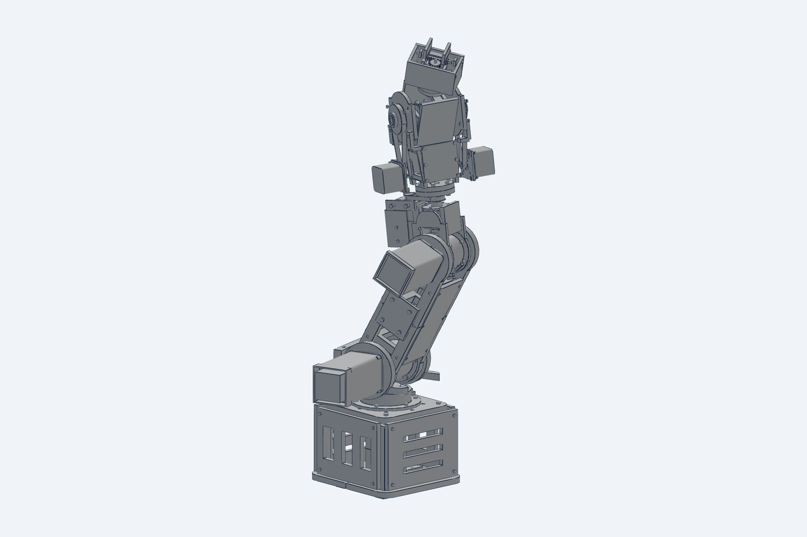

# A robot arm you can print

I am building a six-axis robot arm that you can make at home. Almost every part
of it comes off a 3D printer. What is left over is bearings, stepper
motors and screws, all of it for less then 400$.

## Where this is right now

Work in progress. What sits in this repository today is the printable parts and
nothing else.

The arm is fully designed, and I have checked the motion and the fits in CAD.
But I have not built it, and neither has anyone else. So treat these files as
something to print and look at, not as a finished kit that is known to work.

## The assembly guide is coming

I am writing a proper step-by-step guide. One part per step, with a picture of
the part on its own, a picture of it going in, and a picture of it seated. Every
piece in the arm has a step, and before each new section there is a view of the
whole robot showing you where that section lives.

It is not published yet. It will land here when it is finished.

## What is in here

Everything printable, in `print_parts`, split into seven folders that follow the
order you need them:

- base and J1 turret
- J2 shoulder
- J3 elbow and upper arm
- J4 forearm roll
- J5 and J6 differential wrist
- gripper
- forearm lids

Every part has an STL to print and a STEP next to it if you would rather remesh
it or change something. Each folder has a short readme with the material, layer
height, perimeters, infill, supports and print orientation for each part.

## How the arm works

Six axes, plus a two-finger gripper on the end.

The wrist is the part I am most pleased with. Both wrist motors sit back on the
forearm and never turn with the joint. Two belts drive two input spools, and the
wrist reads the sum of them as pitch and the difference as roll. That means the
tool can spin without ever stopping, because nothing winds up, and it keeps the
weight of two motors off the far end of the arm where you feel it most.

Homing runs on a single pair of wires. The switches are wired in series, so one
break tells the controller a flag arrived, and the axis you were moving tells it
which. The wrist pitch has no switch at all. It finds home by driving gently into
a printed stop.

## A word about material

The readmes name a material for every part and it is worth following. Parts in
the load path or next to a motor are ASA, because stepper bodies get hot enough
that PLA slowly gives way under the permanent squeeze that every bolted joint
lives under.

Covers, gears, pulleys and brackets are PETG and much less fussy.

