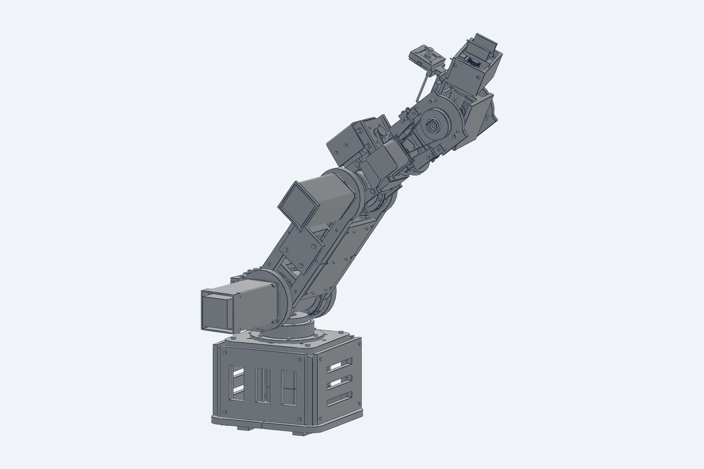
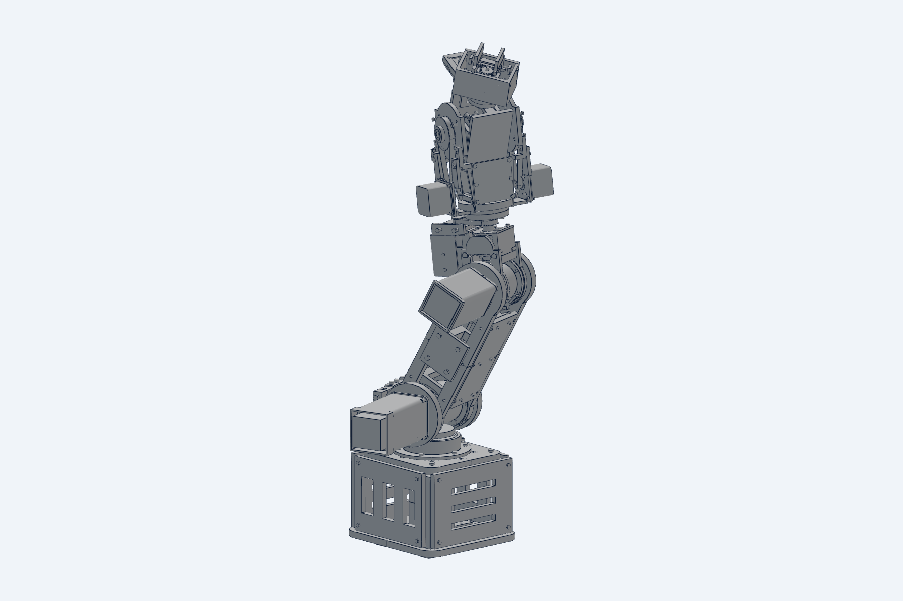

# A robot arm you can print

I am building a six-axis robot arm that you can make at home. Almost every part
of it comes off a 3D printer. What is left over is bearings, stepper
motors and screws, all of it for less than 400$. Alongside the arm I am also
building an AI model for object detection which will run on a Rockchip RK3588.
Camera mount was already added to the model and assembly guides.

## Where this is right now

Work in progress. What sits in this repository today is the printable parts and
the assembly guide, nothing else.

The arm is fully designed, and I have checked the motion and the fits in CAD.
But I have not built it, and neither has anyone else. So treat these files as
something to print and look at, not as a finished kit that is known to work.

## The assembly guide

The assembly guide has been finally published, both czech and english versions.
The manuals were created not only to show how to put the printed pieces together,
but also to act as a shopping list for all the necessary parts. Soon I am planning 
on publishing links for the items needed (as soon as I finish the build and assure good
quality of the parts)

There is also a 3D version of the guide that runs in the browser:
[herz1c.github.io/6DOF-Robotic-Arm](https://herz1c.github.io/6DOF-Robotic-Arm/).
It puts the arm together one part at a time, all 263 steps, and you can turn the
model around to see where each part goes and which side the screws come from.
It works on a phone and there is nothing to install.

## What is in here

Everything printable, in `print_parts`, split into seven folders that follow the
order you need them:

- base and J1 turret
- J2 shoulder
- J3 elbow and upper arm
- J4 forearm roll
- J5 and J6 differential wrist
- gripper
- forearm lids

Both manuals are in `docs` folder, the browser guide in `docs/guide`

Every part has an STL to print and a STEP next to it if you would rather remesh
it or change something. Each folder has a short readme with the material, layer
height, perimeters, infill, supports and print orientation for each part.

## How the arm works

Six axes, plus a two-finger gripper on the end.

The wrist is the part I am most pleased with. Both wrist motors sit back on the
forearm and never turn with the joint. Two belts drive two input spools, and the
wrist reads the sum of them as pitch and the difference as roll. That means the
tool can spin without ever stopping, because nothing winds up, and it keeps the
weight of two motors off the far end of the arm where you feel it most.

Homing runs on a single pair of wires. The switches are wired in series, so one
break tells the controller a flag arrived, and the axis you were moving tells it
which. The wrist pitch has no switch at all. It finds home by driving gently into
a printed stop.

## A word about material

The readmes name a material for every part and it is worth following. Parts in
the load path or next to a motor are ASA, because stepper bodies get hot enough
that PLA slowly gives way under the permanent squeeze that every bolted joint
lives under.

